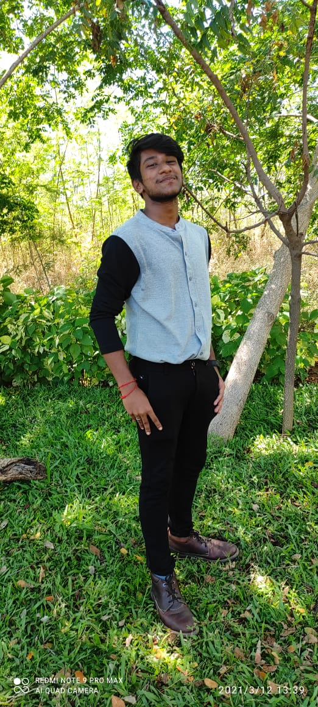
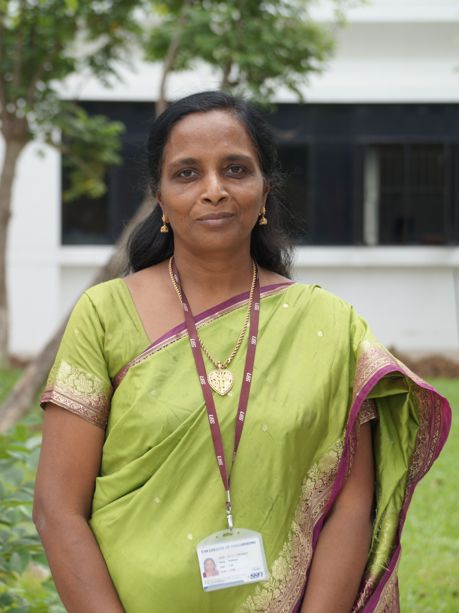

# Crash  Course on Programming in C with Data Structure perspective

This repository contains the material used in the Crash  Course on `Programming in C with Data Structure perspective` for building C programming skills amongst the B.E. Computer Science & Engineering undergraduates in the [Computer Science & Engineering Department](https://www.ssn.edu.in/college-of-engineering/computer-science-and-engineering-department-ssn-institutions/) at [Sri Sivasubramaniya Nadar College of Engineering](https://www.ssn.edu.in/) through a practicum-driven lesson plan during Nov-Dec 2022.

## Team
|Nandakishor V|Nitheesh Kumar N| Dr. S.V. Jansi Rani | Dr. T.T. Mirnalinee |
| :-------------: | :-------------: | :-------------: | :-------------: |
|| | ||
| | |||
|B.E. CSE 2020-2024|B.E. CSE 2020-2024| Associate Professor|Professor & Head of the Department|

## Course Schedule
| Date|Topic|Hands-On Component|
| :-------------: | :-------------: | :-------------: |
| 21-Nov-22|`S01`: C programming Basics|`Tutorial`: Expression Evaluation                       |
| 21-Nov-22|`S02`: Conditional Statements|`Live Code Demo`:Finding greatest of 2, 3 numbers   `Tutorial`: Simple calculator |
| 22-Nov-22|`S03`: Looping Statements|`Tutorial`:Sum of n numbers, Factorial, Patterns          |
| 23-Nov-22|`S04`: Arrays|`Live Code Demo`: Linear Search, Matrix Addition and Multiplication    `Tutorial`: Insertion and Deletion in Arrays|
| 24-Nov-22|`S05`: Array Operations|`Live Code Demo`: Linear Search (Revisit), Selection Sort    `Tutorial`: Insertion Sort|
| 25-Nov-22|`S06`: Strings|`Live Code Demo`: String Copy, Case Conversion    `Tutorial`: String Reversal |
| 26-Nov-22|`S07`: Functions|`Live Code Demo`: Linear Search, Swapping    `Tutorial`: Increment a Variable (by Reference) |
| 28-Nov-22|`S08`: Recursive Functions and Variable Scopes|`Live Code Demo`: Fibonacci, Factorial, Variable Scopes in C    `Tutorial`: Recursion with Pointers, Tail Call Optimization |
| 29-Nov-22|`S09`: Pointers|`Live Code Demo`: Pointer Basics, Pointers and Arrays    `Tutorial`: Allocating and Returning Heap Memory |
| 05-Dec-22|`S10`: More on Pointers|`Live Code Demo`: Pointer Arithmetic, 2D Arrays with Pointers    `Tutorial`: Function Pointers, 2D Dynamic Arrays |
| 06-Dec-22|`S11`: Structures|`Live Code Demo`: Structures I/O, with Arrays and Functions    `Tutorial`: Structures to Represent and Manipulate Fractions |
| 07-Dec-22|`S12`: File Handling|`Live Code Demo`: Text File I/O, Binary File I/O    `Tutorial`: Random Access File Read |
| 08-Dec-22|`S13`: Pointers & Structures|`Live Code Demo`: Dynamic Structure Initialization, Linked Lists    `Tutorial`: Create Linked Lists|
| 09-Dec-22|`S14`: Discussion on DS|`Lecture`: Stacks, Queue, Graph concepts and major algorithms explained with tracing|

## Objective
- To lay solid foundations in C programming using a project-oriented practicum
- To ensure that students are able to implement theoretical concepts programmatically
- To promote collaborative learning by participating in coding parties and Ask Me Anything (AMA) sessions

## Outcomes
- Implement, compile, debug, and execute procedural programs in C
- Implement C programs with appropriate data representation and programming constructs
- Organize programs into functions and modules
- Develop programming projects in C modularly and refine incrementally
- Write clean and well documented code
- Prepare for advanced coursework that employs C programming at its base
- Understand and implement data structures in C
